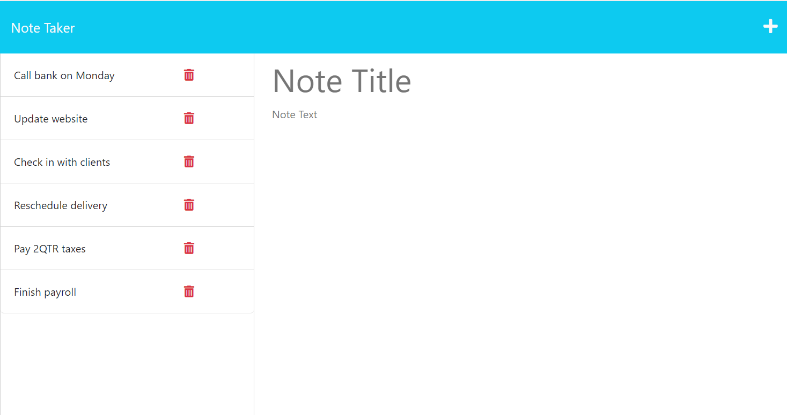

# **Note Taker App**

  [](https://opensource.org/licenses/ISC)

  ## **Description**
  This **Note Taker App** is a tool that a small business owner can use to write and save notes. It can be used to organize thoughts and keep track of tasks that need to be completed. This application uses an Express.js back end and saves and retrieves note data from a JSON file. This app is deployed via Heroku.

  ## **Table of Contents:**
  * [Installation](#installation)
  * [Screenshot of app](#screenshot-of-app) 
  * [Link to deployed app via Heroku](#link-to-deployed-app-via-heroku)
  * [Usage](#usage)
  * [Credits](#credits)
  * [Contribute](#contribute)
  * [License](#license)
  * [GitHub Repository](#github-repository)
  * [Questions](#questions)

  
  ## **Installation**
  To download the source code for this app, clone the [Note Taker App GitHub repo](https://github.com/DonnaThompson7/Note-Taker), then run `npm install`. To start the app, run `npm start`.

  ## **Screenshot of app**
 
  

  ## **Link to deployed app via Heroku**
 [Link to deployed app](https://morning-sierra-83538-7272b75177cb.herokuapp.com/)
 
  ## **Usage**

  This book search app satisfies the following requirements:
  
  User Story 
```md
AS A small business owner
I WANT to be able to write and save notes
SO THAT I can organize my thoughts and keep track of tasks I need to complete
```
Acceptance Criteria
```md
GIVEN a note-taking application
WHEN I open the Note Taker
THEN I am presented with a landing page with a link to a notes page
WHEN I click on the link to the notes page
THEN I am presented with a page with existing notes listed in the left-hand column, plus empty fields to enter a new note title and the note’s text in the right-hand column
WHEN I enter a new note title and the note’s text
THEN a Save icon appears in the navigation at the top of the page
WHEN I click on the Save icon
THEN the new note I have entered is saved and appears in the left-hand column with the other existing notes
WHEN I click on an existing note in the list in the left-hand column
THEN that note appears in the right-hand column
WHEN I click on the Write icon in the navigation at the top of the page
THEN I am presented with empty fields to enter a new note title and the note’s text in the right-hand column
```

  ## **Credits**
  Donna Thompson, developer

  Starter code: UNCC-VIRT-FSF-PT-04-2023-U-LOLC, Module 11 Express, Challenge

  ## **Contribute**
  If you would like to contribute to this app, please submit contributions to the email below.

  ## **License**
Licensed under [The ISC License](https://opensource.org/licenses/ISC).

  ## **GitHub Repository** 
  [github.com/DonnaThompson7/Note-Taker](https://github.com/DonnaThompson7/Note-Taker)

  ## **Questions**
  Please visit my GitHub profile at https://github.com/DonnaThompson7 <br /> Contact me at dlthompson7@icloud.com to report issues, contribute, or if you have additional questions.
